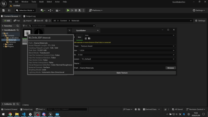

# QuickBaker QuickStart Guide

**QuickBaker** is a lightweight material baking tool for Unreal Engine 5.5+. It allows you to convert any material's "Emissive Color" (Final Color) output into a static Texture Asset (.uasset) or an image file (.png, .exr) with a single click. Ideally suited for baking noise patterns, Signed Distance Fields (SDF), and procedural textures.

### 1. Installation & Setup
1. Install **QuickBaker** to your engine via the **Fab Launcher (or Epic Games Launcher)**.
2. Open your Unreal Engine project.
3. Go to **Edit** > **Plugins**.
4. Search for "QuickBaker" and check the box to enable it (restart the editor if prompted).

### 2. Getting Started
**Step 1: Open the Window**
Go to **Tools** > **QuickBaker** > **Quick Baker** in the menu bar to open the tool window.

**Step 2: Select a Material**
Select the **Material** or **Material Instance** you want to bake.
* Note: This tool captures the output connected to the **Emissive Color** pin. A thumbnail preview will appear.

**Step 3: Configure Settings**
Adjust the settings based on your needs:
* **Output Type**: Choose `Asset` to save within the project, or `PNG` / `EXR` to export to disk.
* **Resolution**: Select a resolution ranging from 64x64 up to 8192x8192.
* **Bit Depth**: Use `8-bit` for standard textures. `16-bit` is recommended for high-precision data like SDFs or noise to avoid banding.

**Step 4: Bake**
1. Click `Browse` next to **Output Path** to select the destination folder.
2. Click the **Bake Texture** button. Your texture will be generated and saved instantly.

### 3. Troubleshooting
**Q: The baked texture is completely black.**
A: Please ensure your logic is connected to the **Emissive Color** pin in your material.
* Even if you are using a **Lit** material, you must connect your graph to Emissive Color for the baker to see it.
* For best results, we recommend setting your material's Shading Model to **Unlit**.
