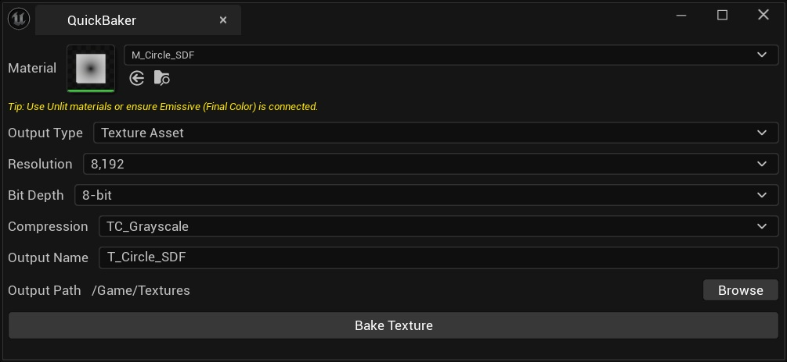

# QuickBaker

QuickBaker is a simple and fast tool to bake Material expressions (Emissive/Final Color) into Static Textures for Unreal Engine 5.5+.

> **First time? Check out the [Quick Start Guide](QUICKSTART.md) to get started in seconds!**

## Architecture

The QuickBaker plugin is structured following the Single Responsibility Principle, ensuring maintainability and scalability.

### Class Diagram / Responsibilities

- **FQuickBakerModule**: Handles module lifecycle (startup/shutdown), registers the editor tab, and manages menu entries.
- **FQuickBakerSettings**: A pure data structure (struct) that holds the configuration for the bake operation (Resolution, Output Type, Paths, etc.). Includes validation logic.
- **FQuickBakerCore**: Contains the core business logic for the baking process.
  - Setup of Render Targets.
  - Rendering of the selected material.
  - Handling creation of Texture Assets (`.uasset`) and transactions.
- **FQuickBakerExporter**: Dedicated class for exporting render targets to external files (PNG, EXR). Handles image wrapper interactions and file system writing.
- **SQuickBakerWidget**: The Slate UI widget.
  - Manages all UI elements (ComboBoxes, Buttons, Thumbnails).
  - Handles user interactions.
  - Constructs `FQuickBakerSettings` from UI state and delegates execution to `FQuickBakerCore`.

## Introduction
QuickBaker streamlines the process of converting dynamic materials into static textures. Whether you need to bake complex noise patterns, signed distance fields (SDF), or procedural textures, QuickBaker handles the setup, rendering, and saving process with a single click. It supports saving directly as a Texture Asset (`.uasset`) or exporting to disk as PNG or EXR.

## Features
- **Multi-Format Support**:
  - **Texture Asset**: Save directly to the Content Browser.
  - **PNG**: Export to disk (8-bit fixed, Supports Alpha/Transparency).
  - **EXR**: Export to disk (16-bit float fixed, Linear), ideal for high-precision data like height maps.
- **Smart UI**:
  - **Thumbnail Preview**: Instantly see a 64x64 preview of your selected material.
  - **Auto-Naming**: Automatically converts `M_` or `MI_` prefixes to `T_` (e.g., `M_Noise` becomes `T_Noise`).
  - **Dynamic Settings**: The "Bit Depth" dropdown locks automatically based on the selected Output Type to prevent invalid configurations.
- **Workflow Efficiency**:
  - **Auto-Create Folders**: Destination folders are created automatically if they don't exist.
  - **Context-Sensitive Browse**: Opens the Content Browser for Assets and the OS File Dialog for external exports.
  - **Flexible Settings**: Supports resolutions from 64 to 8192, 8/16-bit depth, and various compression settings (Default, Normalmap, Grayscale, HDR).

## Installation
1. Close Unreal Engine.
2. Copy the `QuickBaker` folder into the `Plugins` directory of your Unreal Engine project (e.g., `MyProject/Plugins/QuickBaker`).
   - If the `Plugins` folder does not exist, create it in your project's root directory.
3. Open your project.
4. Enable the plugin via **Edit > Plugins** if it is not already enabled (it should be enabled by default).

## Usage Guide
1. Open the tool via **Tools > QuickBaker > Quick Baker**.
2. **Select Material**: Choose the Material or Material Instance you want to bake. A thumbnail preview will appear.
   - *Note: The tool captures the "Final Color" (Emissive) output of the material.*
3. **Select Output Type**:
   - **Asset**: Saves a `.uasset` to your project.
   - **PNG** or **EXR**: Saves an image file to your computer.
4. **Configure Settings**:
   - **Resolution**: Choose a size between 64x64 and 8192x8192.
   - **Bit Depth**: Select 8-bit or 16-bit (locked for PNG/EXR). 16-bit is recommended for smooth gradients.
   - **Compression**: Choose the texture compression (e.g., `TC_Normalmap` for normal maps).
5. **Set Output Path**:
   - Click **Browse** to select the destination folder.
   - The **Output Name** is automatically generated but can be customized.
6. Click **Bake Texture**.

## Requirements
- Unreal Engine 5.5 or later.

## FAQ

### Q: The baked texture is completely black. What's wrong?
**A:** QuickBaker captures the **Final Color (Emissive)** output of materials. If your material doesn't have anything connected to the Emissive Color pin, the output will be black.

**Solutions:**
- **Use Unlit Materials**: Unlit materials only use the Emissive Color input, making them ideal for baking.
- **Connect to Emissive**: If using a Lit material (DefaultLit, Subsurface, etc.), connect your desired output to the **Emissive Color** pin.
- **Example Setup**:
  - For noise textures: Connect your noise directly to Emissive Color.
  - For color/albedo: Connect Base Color to Emissive Color.
  - For normal maps: This tool is not suitable (use dedicated normal map bakers).

### Q: Which texture types work best with QuickBaker?
**A:** QuickBaker excels at baking:
- Procedural noise patterns
- Signed Distance Fields (SDF)
- Gradient textures
- Mathematical/computational textures
- Any Material Expression that outputs a color

It is **not designed** for baking lighting, shadows, or normal maps.

### Q: What's the difference between 8-bit and 16-bit?
**A:**
- **8-bit**: Standard color precision. Use for regular textures.
- **16-bit**: High precision. **Strongly recommended** for noise textures and SDFs to avoid color banding/posterization.

Note: PNG export is locked to 8-bit, EXR export is locked to 16-bit float.

## Known Issues

1.  **HDR Clamping in 8-bit mode**:
    *   When using **Asset (8-bit)** or **PNG**, values exceeding 1.0 (HDR) are clamped.
    *   If you need to preserve HDR values, please use **EXR** or **Asset (16-bit)**.

2.  **View-Dependent Material Nodes**:
    *   Nodes like `Fresnel` or `CameraVector` depend on the camera angle.
    *   Since QuickBaker captures from a fixed perspective, these may not produce the expected results.

## License
This project is available under the MIT License.
